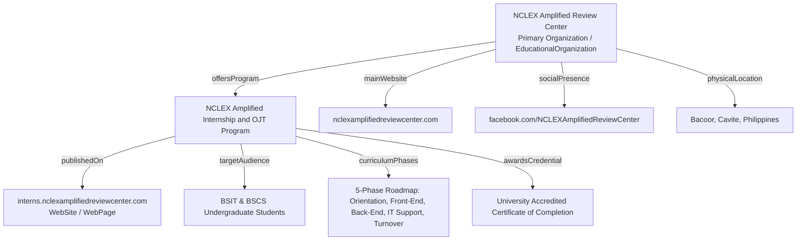

# 01. SEO & AEO Master Strategy

> **Website**: [https://interns.nclexamplifiedreviewcenter.com/](https://interns.nclexamplifiedreviewcenter.com/)  
> **Entity**: NCLEX Amplified Review Center  
> **Topic**: Official Information Technology & Computer Science Internship & OJT Program  

---

## 1. Primary Objectives

The primary objective of this strategy is to position **NCLEX Amplified Interns** as the authoritative, discoverable, and primary source of information for students, educators, and search engines regarding the organization's official On-the-Job Training (OJT) and internship offerings.

### Multi-Platform Discovery Target:
- **Traditional Search Engines**: Google, Microsoft Bing, Yahoo, DuckDuckGo.
- **AI Answer Engines & RAG Systems**: Google AI Overviews, Perplexity AI, ChatGPT (Search & GPTs), Claude, Gemini, Microsoft Copilot.
- **Academic & Institutional Navigators**: University OJT coordinators, internship placement offices, and undergraduate IT/CS candidates.

---

## 2. Core Communication Framework

Every search engine crawler and AI synthesis agent that parses the website must immediately extract six fundamental facts without ambiguity:

```
                                  ┌─────────────────────────────────────────┐
                                  │     NCLEX Amplified Review Center       │
                                  │      (Premier Review Center PH)         │
                                  └────────────────────┬────────────────────┘
                                                       │
                                        operates official program
                                                       │
                                                       ▼
                                  ┌─────────────────────────────────────────┐
                                  │   Official IT / CS Internship & OJT     │
                                  │  (https://interns.nclexamplified...)    │
                                  └────────────────────┬────────────────────┘
                                                       │
         ┌─────────────────────────┬───────────────────┼─────────────────────────┬─────────────────────────┐
         │                         │                   │                         │                         │
         ▼                         ▼                   ▼                         ▼                         ▼
┌──────────────────┐     ┌───────────────────┐ ┌───────────────┐     ┌───────────────────┐     ┌───────────────────┐
│  Target Audience │     │  7 Spec. Tracks   │ │ Real Workflows│     │ University Credit │     │ Verified Contact  │
│  BSIT & BSCS     │     │  Web, Backend, QA,│ │ DTR, Sandbox, │     │ 100% Accredited   │     │ Bacoor, Cavite    │
│  Undergraduates  │     │  DevOps, UI/UX... │ │ Cert Studio   │     │ Cert of Completion│     │ Phone, Email, FB  │
└──────────────────┘     └───────────────────┘ └───────────────┘     └───────────────────┘     └───────────────────┘
```

1. **What NCLEX Amplified Review Center is**: Founded in 2021, the Philippines' premier review center dedicated to empowering nurses to conquer the NCLEX exam and fostering digital innovation through structured student internships.
2. **What the Website Provides**: The official web portal, curriculum roadmap, interactive tools (Live DTR System, Code Assessment Sandbox, Certificate Creator Studio), and application system for the internship program.
3. **Who the Program is For**: Exclusively open to currently enrolled **BS Information Technology (BSIT)** and **BS Computer Science (BSCS)** undergraduate students completing academic practicum requirements (200 to 600 hours).
4. **What Training Programs Are Available**: 7 specialized tracks:
   - Front-End Web Engineering
   - Back-End & API Development
   - Software QA & Automation
   - IT Infrastructure & Support
   - Database & Data Analytics
   - UI/UX & Product Design
   - DevOps & Cloud Operations
5. **Why Users Should Trust the Organization**: 100% university accredited with formal Certificates of Completion, real production code contributions, documented student testimonials, and direct mentorship by senior technical supervisors.
6. **How to Contact and Apply**: Streamlined online application portal, physical office at *BLK 12 Lot 13, Bahayang Pag-ASA Subd, Molino V Avenida Rizal, Bacoor, 4102 Cavite*, direct phone `0920 651 0410`, and email `nclexamplifiedhr@gmail.com`.

---

## 3. Entity SEO Architecture

To establish knowledge graph dominance, the site connects entities using clear semantic relationships:



### Entity Consistency Rules:
- **Brand Representation**: The brand name is consistently rendered as **NCLEX Amplified Review Center** or **NCLEX Amplified Interns**.
- **Domain Association**: Primary domain `https://nclexamplifiedreviewcenter.com/` and the internship subdomain `https://interns.nclexamplifiedreviewcenter.com/` are explicitly linked via `sameAs`, `publisher`, and `isPartOf` schema properties.
- **Canonical Geolocation**: Bacoor, Cavite, Philippines (`PH-CAV`, lat `14.4137`, long `120.9786`).

---

## 4. E-E-A-T Trust & Authority Framework

Search engines (especially Google Quality Raters and AI algorithms) prioritize content demonstrating **Experience, Expertise, Authoritativeness, and Trustworthiness**:

| Dimension | Real Evidence on Site | Implementation in Code & Metadata |
| :--- | :--- | :--- |
| **Experience** | Real intern alumni quotes, verified contributions, and interactive tooling. | Testimonial schema, intern profiles, and photo gallery with descriptive alt tags. |
| **Expertise** | Named program mentors (*Gene Mathew Wagas*, *Mark Christian Naval*) and structured 5-phase engineering curriculum. | Mentorship attribution in curriculum stage cards and JSON-LD schema. |
| **Authoritativeness** | 100% University accreditation, formal MOA support, and signed Certificates of Completion. | Official credential showcase, school endorsement checklists, and accredited badge displays. |
| **Trustworthiness** | Physical office address in Bacoor, Cavite, active phone lines, official Facebook page, and transparent contact channels. | `PostalAddress`, `ContactPoint`, and Open Graph organization metadata. |

---

## 5. Content Quality & Anti-Keyword Stuffing Rules

All content on the page and in metadata follows strict natural language guidelines:

1. **Natural Human Voice**: Written in an engaging, professional, and collegiate tone tailored to ambitious undergraduate students.
2. **Zero Keyword Stuffing**: Prohibited repetitive phrases. Varied semantic synonyms (`OJT`, `practicum`, `student internship`, `hands-on training`, `real-world engineering`) are used contextually.
3. **No Fabricated Claims**: Every statement is grounded in the actual program structure, real alumni experiences, and verifiable organizational data.
4. **Information Density**: Content is written directly to answer the user's intent without filler words or redundant fluff.
