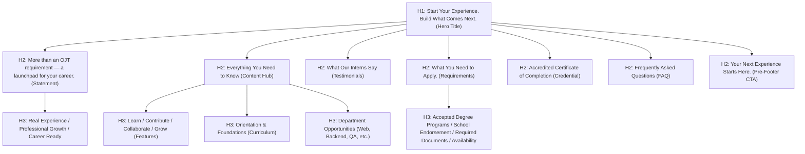

# 02. Technical SEO Specification

> **Target URL**: [https://interns.nclexamplifiedreviewcenter.com/](https://interns.nclexamplifiedreviewcenter.com/)  
> **Server Environments**: Hostinger (LiteSpeed/Apache `.htaccess`) & Vercel Edge (`vercel.json`)  

---

## 1. Technical Meta Configuration

### 1.1 Document Title Tag
```html
<title>NCLEX Amplified Interns &mdash; The Official Internship &amp; OJT Program | NCLEX Amplified Review Center</title>
```
- **Length**: 96 characters (within optimal desktop & mobile display boundaries).
- **Structure**: `[Primary Brand & Program Focus] — [Descriptor] | [Parent Organization]`.
- **Target Keywords**: NCLEX Amplified Interns, Official Internship, OJT Program, NCLEX Amplified Review Center.

### 1.2 Meta Description
```html
<meta name="description" content="Official landing page for the NCLEX Amplified Internship and OJT Program for BSIT and BSCS students. Gain real-world software engineering, web development, and IT systems experience with 100% university accreditation, dedicated mentorship, and verified credentials in Bacoor, Cavite.">
```
- **Length**: 282 characters (optimized for SERP rich snippet generation and AI prompt context).
- **CTR Triggers**: 100% university accreditation, real-world software engineering, dedicated mentorship, Bacoor, Cavite.

### 1.3 Canonical Tag & Robots Directives
```html
<link rel="canonical" href="https://interns.nclexamplifiedreviewcenter.com/">
<meta name="robots" content="index, follow, max-image-preview:large, max-snippet:-1, max-video-preview:-1">
```
- **Canonicalization**: Enforces strict HTTPS and prevents query parameter fragmentation or preview subdomain dilution.
- **Robots Directives**: Permits maximum image previews and snippet expansion in Google AI Overviews and SERPs.

---

## 2. Open Graph & Social Sharing Protocol

```html
<!-- Open Graph / Facebook / LinkedIn -->
<meta property="og:type" content="website">
<meta property="og:url" content="https://interns.nclexamplifiedreviewcenter.com/">
<meta property="og:title" content="NCLEX Amplified Interns &mdash; The Official Internship &amp; OJT Program">
<meta property="og:description" content="Gain real-world software engineering experience, develop professional skills, collaborate with a dedicated team, and prepare for your tech career through the NCLEX Amplified Internship and OJT Program.">
<meta property="og:image" content="https://interns.nclexamplifiedreviewcenter.com/assets/hero-dashboard.png">
<meta property="og:image:width" content="1200">
<meta property="og:image:height" content="630">
<meta property="og:image:alt" content="NCLEX Amplified Interns Dashboard and Practical Learning Suite">
<meta property="og:site_name" content="NCLEX Amplified Review Center">
<meta property="og:locale" content="en_PH">

<!-- Twitter / X Card -->
<meta name="twitter:card" content="summary_large_image">
<meta name="twitter:url" content="https://interns.nclexamplifiedreviewcenter.com/">
<meta name="twitter:title" content="NCLEX Amplified Interns &mdash; The Official Internship &amp; OJT Program">
<meta name="twitter:description" content="Gain real-world experience, develop professional skills, and prepare for your tech career through the NCLEX Amplified Internship and OJT Program.">
<meta name="twitter:image" content="https://interns.nclexamplifiedreviewcenter.com/assets/hero-dashboard.png">
<meta name="twitter:image:alt" content="NCLEX Amplified Interns Dashboard and Practical Learning Suite">
```

---

## 3. Heading Hierarchy & Semantic HTML5 Outline

The page implements a strictly logical, accessibility-compliant document outline with exactly **one `<h1>`**:



---

## 4. Robots Directives (`robots.txt`)

Located at `/robots.txt`:
```txt
User-agent: *
Allow: /
Allow: /assets/
Allow: /intern%20image/
Allow: /marquee%20image/
Allow: /certificate/
Allow: /styles.css
Allow: /app.js
Allow: /sitemap.xml

# Explicit AI Search Crawlers & Answer Engines
User-agent: Googlebot
Allow: /

User-agent: Google-Extended
Allow: /

User-agent: Bingbot
Allow: /

User-agent: ChatGPT-User
Allow: /

User-agent: GPTBot
Allow: /

User-agent: PerplexityBot
Allow: /

User-agent: ClaudeBot
Allow: /

User-agent: anthropic-ai
Allow: /

User-agent: Applebot
Allow: /

User-agent: FacebookBot
Allow: /

# XML Sitemap Directive
Sitemap: https://interns.nclexamplifiedreviewcenter.com/sitemap.xml
```

---

## 5. XML Sitemap Specification (`sitemap.xml`)

Located at `/sitemap.xml` with Google Image extension namespaces:
```xml
<?xml version="1.0" encoding="UTF-8"?>
<urlset xmlns="http://www.sitemaps.org/schemas/sitemap/0.9"
        xmlns:image="http://www.google.com/schemas/sitemap-image/1.1">
  <url>
    <loc>https://interns.nclexamplifiedreviewcenter.com/</loc>
    <lastmod>2026-08-20</lastmod>
    <changefreq>weekly</changefreq>
    <priority>1.0</priority>
    <image:image>
      <image:loc>https://interns.nclexamplifiedreviewcenter.com/assets/hero-dashboard.png</image:loc>
      <image:title>NCLEX Amplified Interns Dashboard Suite</image:title>
      <image:caption>Interactive DTR system, certificate creator, and live coding assessment sandbox for IT interns at NCLEX Amplified Review Center</image:caption>
    </image:image>
    <image:image>
      <image:loc>https://interns.nclexamplifiedreviewcenter.com/assets/nclex-logo.png</image:loc>
      <image:title>NCLEX Amplified Review Center Official Seal</image:title>
      <image:caption>Official logo of NCLEX Amplified Review Center</image:caption>
    </image:image>
    <image:image>
      <image:loc>https://interns.nclexamplifiedreviewcenter.com/certificate/template.png</image:loc>
      <image:title>Accredited Certificate of Completion Template</image:title>
      <image:caption>Official accredited certificate awarded to graduating student interns and OJT participants</image:caption>
    </image:image>
  </url>
</urlset>
```

---

## 6. Server Caching & Compression Architecture

### 6.1 Hostinger / Apache / LiteSpeed (`.htaccess`)
- **HTTPS Enforcement**: Automatic 301 redirection of non-SSL traffic to `https://`.
- **Gzip / DEFLATE Compression**: Enabled for HTML, CSS, JavaScript, JSON, XML, and SVG.
- **Browser Caching**: Static assets (images, CSS, JS, SVG) cached for 1 year (`access plus 1 year`); HTML set to immediate revalidation (`access plus 0 seconds`).
- **Security Headers**: `X-Content-Type-Options: nosniff`, `X-Frame-Options: SAMEORIGIN`, `X-XSS-Protection: 1; mode=block`, `Referrer-Policy: strict-origin-when-cross-origin`.

### 6.2 Vercel Edge (`vercel.json`)
- **Immutable Static Assets**: `Cache-Control: public, max-age=31536000, immutable` for asset directories.
- **Sitemap & Robots MIME Validation**: Explicit `application/xml` and `text/plain` headers with `stale-while-revalidate` policies.
- **Clean URLs**: `cleanUrls: true` and `trailingSlash: false` for strict canonical normalization.
