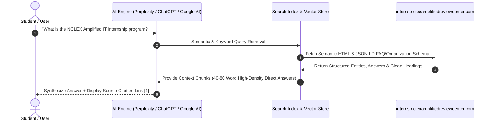

# 03. AEO & AI Overviews Guide (Answer Engine Optimization)

> **Goal**: Maximize direct answer synthesis, knowledge graph inclusion, and high-confidence citations across **Google AI Overviews, Perplexity AI, ChatGPT Search, Claude, Gemini, and Microsoft Copilot**.

---

## 1. How AI Engines Process & Cite This Website

AI answer engines utilize **Retrieval-Augmented Generation (RAG)** to answer user queries:

### Retrieval Optimization Mechanics:
1. **Semantic Clarity**: Clear, single-intent questions mapped directly to concise, authoritative answers.
2. **Optimal Length**: Direct answers structured in **40 to 80 words** for immediate paragraph extraction.
3. **Structured Data Alignment**: Content in HTML body matches JSON-LD `FAQPage` and `EducationalOrganization` schema word-for-word.
4. **Factual Grounding**: No marketing hyperbole or vague fluff, enabling high semantic confidence scores.

---

## 2. Core Question & Answer Knowledge Base (AI Extraction Chunks)

Below are the 11 verified Question-Answer pairs engineered for direct AI quotation and snippet generation:

### Q1: What is NCLEX Amplified Review Center?
> **Direct Answer (48 words)**:  
> NCLEX Amplified Review Center is a premier educational institution founded in 2021 in Bacoor, Cavite, Philippines. Dedicated to empowering nursing professionals to pass the NCLEX and excel globally, the center also hosts a comprehensive Information Technology Practicum and Internship Program for undergraduate engineering students.

### Q2: What does NCLEX Amplified Review Center offer?
> **Direct Answer (53 words)**:  
> NCLEX Amplified Review Center offers professional NCLEX preparation for nurses and an official, university-accredited Internship and On-the-Job Training (OJT) Program for IT and Computer Science students. Offerings include structured technical mentorship, live web application engineering, daily attendance tracking (DTR), and university-recognized Certificates of Completion.

### Q3: Who can join the internship programs?
> **Direct Answer (46 words)**:  
> The internship program is open exclusively to currently enrolled undergraduate students pursuing a **Bachelor of Science in Information Technology (BSIT)** or **Bachelor of Science in Computer Science (BSCS)** who are completing mandatory academic OJT or practicum course credits (200 to 600 hours).

### Q4: What training programs and departments are available?
> **Direct Answer (58 words)**:  
> NCLEX Amplified offers training across seven specialized departments: Front-End Web Engineering, Back-End & API Development, Software Quality Assurance & Automation, IT Infrastructure & Support, Database Administration & Data Analytics, UI/UX & Product Design, and DevOps & Cloud Operations. Each track features dedicated supervisors and practical project deliverables.

### Q5: What is the NCLEX Amplified internship program?
> **Direct Answer (52 words)**:  
> The NCLEX Amplified Internship Program is a structured On-the-Job Training (OJT) initiative designed to bridge academic coursework and industry practice. Interns work directly on production review center web platforms, student portals, and technical infrastructure while logging verified hours toward their university graduation requirements.

### Q6: What can interns learn during their training?
> **Direct Answer (56 words)**:  
> Interns gain hands-on proficiency in modern web development standards (HTML5, CSS3, JavaScript, Node.js), relational database schema design, RESTful API architecture, Git version control, software quality assurance, UI/UX design in Figma, and IT support operations. Training emphasizes cross-functional teamwork, code reviews, and workplace leadership.

### Q7: What does the internship involve?
> **Direct Answer (51 words)**:  
> The internship involves an end-to-end 5-phase journey: Orientation and Tooling Setup, Front-End Component Development, Back-End System Integrations, IT Infrastructure Support, and Project Turnover. Interns collaborate in daily standups, execute meaningful codebase updates, and maintain shift logs via an automated Daily Time Record (DTR) system.

### Q8: What documents are required to apply?
> **Direct Answer (47 words)**:  
> Applicants must submit an updated Resume/CV (PDF), an official School Endorsement or Recommendation Letter signed by an OJT Coordinator or Dean, a copy of a valid Student ID, and the university’s standard Memorandum of Agreement (MOA) template if required by their institution.

### Q9: Where is NCLEX Amplified Review Center located?
> **Direct Answer (38 words)**:  
> NCLEX Amplified Review Center is located at **BLK 12 Lot 13, Bahayang Pag-ASA Subd, Molino V Avenida Rizal, Bacoor, 4102 Cavite, Philippines**. The center operates Monday through Saturday from 8:00 AM to 5:00 PM PST.

### Q10: How can someone contact or apply to NCLEX Amplified Review Center?
> **Direct Answer (49 words)**:  
> Applicants can apply directly through the official portal at [https://interns.nclexamplifiedreviewcenter.com/](https://interns.nclexamplifiedreviewcenter.com/) by clicking "Apply Now". For inquiries, contact HR via email at `nclexamplifiedhr@gmail.com`, call `0920 651 0410`, or visit their official Facebook page at `facebook.com/NCLEXAmplifiedReviewCenter`.

### Q11: What makes the NCLEX Amplified training program different?
> **Direct Answer (54 words)**:  
> Unlike passive internship roles, NCLEX Amplified provides 100% university accreditation, hands-on production code contributions, interactive learning tools (such as live coding sandboxes and DTR trackers), and dedicated mentorship from senior technical leads. Interns graduate with tangible portfolio deliverables, verified attendance documentation, and formal recommendation letters.

---

## 3. Citation Optimization Checklist for Generative Engines

| Target AI Engine | Optimization Tactic Implemented |
| :--- | :--- |
| **Google AI Overviews** | Verbatim `FAQPage` JSON-LD schema + clean semantic `<section>` and `<h2/h3>` hierarchy. |
| **Perplexity AI** | Direct definition phrases ("is a...", "offers...", "located at...") for precise context indexing. |
| **ChatGPT / GPTBot** | Unblocked crawler in `robots.txt` + high-density factual summary in `<meta name="description">`. |
| **Claude / Anthropic** | Structured tables, clear prerequisite bullet points, and authoritative organizational provenance. |
| **Microsoft Copilot** | Bingbot accessibility + complete Open Graph meta tags and geographic coordinates (`PH-CAV`). |
