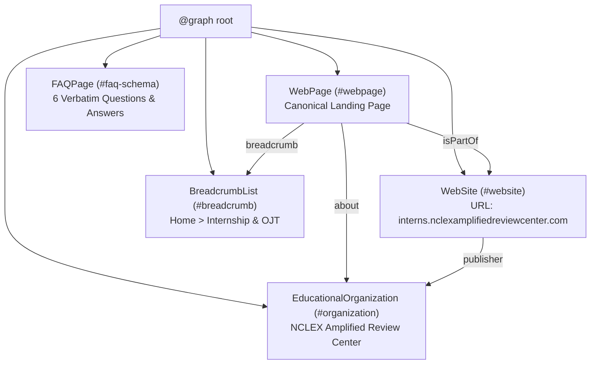

# 04. Structured Data & Schema.org Implementation Guide

> **Standard**: Schema.org JSON-LD (JavaScript Object Notation for Linked Data)  
> **Schema Types**: `WebSite`, `EducationalOrganization`, `WebPage`, `BreadcrumbList`, `FAQPage`  
> **Validation Tools**: Google Rich Results Test, Schema Markup Validator  

---

## 1. Structured Data Graph Overview

The structured data uses an integrated `@graph` array to link all site entities into a unified semantic knowledge web. This allows search engines to understand that the **WebPage** belongs to the **WebSite**, which is published by the **EducationalOrganization**, containing specific **FAQ items** and **Breadcrumbs**.

---

## 2. Implemented Schema Entities Breakdown

### 2.1 `EducationalOrganization`
Anchors the institutional identity of the organization, providing official name, aliases, physical address in Bacoor, Cavite, phone number, admissions email, and official Facebook page link.

### 2.2 `WebSite`
Defines the primary web property, language declaration (`en-US`), and authoritative ownership by the organization.

### 2.3 `WebPage`
Defines the specific indexable document, primary topic, and semantic description.

### 2.4 `BreadcrumbList`
Provides navigational hierarchy:
1. `NCLEX Amplified Review Center` (`https://nclexamplifiedreviewcenter.com/`)
2. `Internship & OJT Program` (`https://interns.nclexamplifiedreviewcenter.com/`)

### 2.5 `FAQPage`
Contains the 6 user-facing FAQ questions and answers, exactly matching the visible accordion content on the page to prevent policy violations.

---

## 3. Policy & Quality Compliance Guarantees

1. **Zero Hallucination**: No fake review stars (`AggregateRating`), fake price schemas (`Offer`), fake events (`Event`), or false student enrollment numbers.
2. **100% Content Matching**: Schema properties directly correspond to visible text in `index.html`.
3. **Valid JSON-LD Syntax**: Tested for clean commas, properly escaped strings, valid URLs, and structured ISO dates.
4. **Rich Results Eligibility**: Directly qualifies the site for Google FAQ rich snippet accordion displays in search results.
