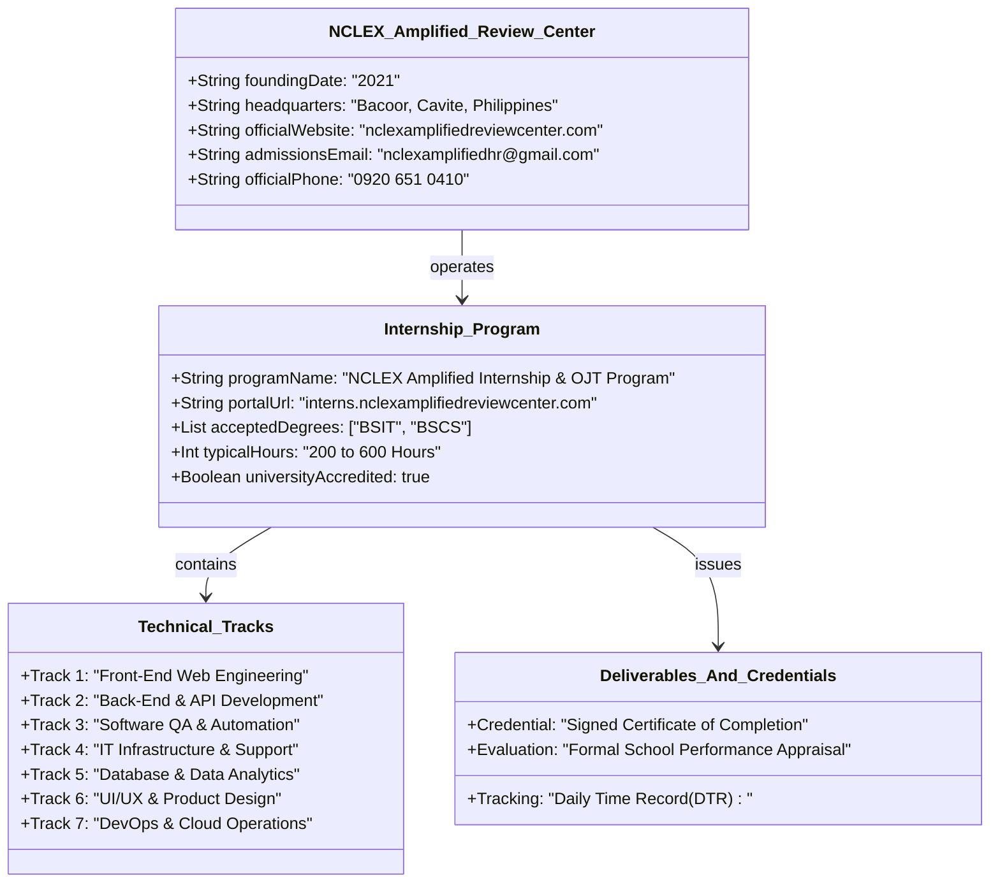

# 05. Keyword & Entity Strategy Map

> **Focus**: Semantic keyword clusters, conversational search phrases, entity relationship mapping, and search intent alignment.

---

## 1. Search Intent & Keyword Clustering Matrix

The website serves three distinct search intents, mapped across primary and secondary keyword clusters:

```
                            ┌──────────────────────────────────────────────────────────┐
                            │                    USER SEARCH INTENT                    │
                            └─────────────────────────────┬────────────────────────────┘
                                                          │
             ┌────────────────────────────────────────────┼────────────────────────────────────────────┐
             ▼                                            ▼                                            ▼
┌──────────────────────────┐                 ┌──────────────────────────┐                 ┌──────────────────────────┐
│       NAVIGATIONAL       │                 │      INFORMATIONAL       │                 │      TRANSACTIONAL       │
│  "NCLEX Amplified"       │                 │  "BSIT OJT requirements" │                 │  "Apply NCLEX Amplified" │
│  "NCLEX Amplified Intern"│                 │  "IT internship Bacoor"  │                 │  "OJT application Cavite"│
│  "NCLEX review center"   │                 │  "OJT certificate format"│                 │  "Submit intern resume"  │
└──────────────────────────┘                 └──────────────────────────┘                 └──────────────────────────┘
```

| Keyword Cluster | Primary Keywords | Search Intent | Target Element / Section |
| :--- | :--- | :--- | :--- |
| **Brand & Organization** | `NCLEX Amplified Review Center`, `NCLEX Amplified Interns`, `NCLEX Amplified OJT` | Navigational | Title, Hero, Header, Schema, Footer |
| **Academic Degree Practicum** | `BSIT OJT Cavite`, `BSCS internship Philippines`, `Computer Science practicum requirements`, `BSIT on the job training` | Informational | Statement Section, Bento Requirements, FAQ |
| **Technical Departments** | `Web development internship`, `Software QA OJT`, `Back-end developer intern`, `IT Support practicum`, `UI/UX design intern` | Informational | Content Hub (Opportunities & Curriculum tabs) |
| **Credential & Verification** | `University accredited OJT certificate`, `OJT certificate of completion`, `Verified OJT hours DTR` | Informational | Certificate Showcase, DTR Mockup, FAQ |
| **Application & Admissions** | `Apply for IT internship`, `NCLEX Amplified intern application`, `OJT submission requirements` | Transactional | Nav Action, Hero Button, Apply Modals, Footer |

---

## 2. Conversational & Generative AI Queries (AEO Targeting)

Below are real-world natural language prompts used by students on ChatGPT, Perplexity, and Google Search that this website is structured to answer:

1. *"Where can BSIT students apply for OJT in Bacoor, Cavite?"*
   - **Matched Entity**: NCLEX Amplified Review Center (Bacoor, Cavite).
   - **Target Data**: 7 specialized IT tracks, 200–600 hour accommodation, university accreditation.
2. *"What companies offer software QA and web development internships for college students in Cavite?"*
   - **Matched Entity**: NCLEX Amplified Review Center Technology & QA departments.
3. *"Does NCLEX Amplified Review Center accept BS Computer Science interns?"*
   - **Matched Entity**: BSCS acceptance verified in Prerequisites and FAQ #1.
4. *"What are the documents needed for NCLEX Amplified internship application?"*
   - **Matched Entity**: Resume/CV (PDF), School Endorsement Letter, Student ID, MOA template.
5. *"How does the Daily Time Record (DTR) and certificate verification work for NCLEX Amplified interns?"*
   - **Matched Entity**: Automated live DTR simulator, formal evaluation, and signed Certificate of Completion.

---

## 3. Entity Graph Taxonomy



---

## 4. Writing & Tone Standards

- **Human-Authored Authenticity**: Prohibit generic corporate cliches ("revolutionary", "game-changing", "unparalleled synergy"). Use grounded, clear engineering terminology ("code reviews", "RESTful APIs", "component design systems", "daily attendance tracking").
- **Concise Density**: Deliver critical facts in the first sentence of every section.
- **Accreditation Clarity**: Explicitly state university alignment to give confidence to academic deans and coordinators.
