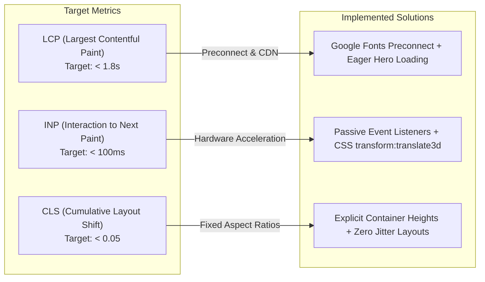

# 06. Image & Performance SEO Audit

> **Scope**: Image alt text audit, responsive asset loading, Cumulative Layout Shift (CLS) prevention, Core Web Vitals, and resource prioritization.

---

## 1. Complete Image Asset Registry & Alt Text Matrix

Every image on the website has been audited and cataloged with descriptive, accessible, and SEO-friendly attributes:

| Asset Path | Location / Role | `alt` Text Content | Loading Strategy |
| :--- | :--- | :--- | :--- |
| `assets/nclex-logo.png` | Intro Overlay & Header Brand | `NCLEX Amplified Review Center Official Seal` / `...Logo` | `loading="eager"` |
| `assets/hero-dashboard.png` | Hero Mockup Panel 5 | `NCLEX Amplified I.T. Intern Dashboard Overview - DTR, Code Sandbox, and Certificate Studio` | `loading="eager"` |
| `certificate/template.png` | Studio Panel 2 & Cert Section | `NCLEX Amplified Accredited Certificate of Completion Template Preview` | `loading="lazy"` |
| `intern image/mark.png` | Testimonial Card 1 & Modal | `Mark Peligros, Tech Support and Creatives Intern at NCLEX Amplified Review Center` | `loading="lazy"` |
| `intern image/keith.png` | Testimonial Card 2 | `Keith Ciceron, Software Developer and Web Developer Intern at NCLEX Amplified Review Center` | `loading="lazy"` |
| `intern image/ysmael.png` | Testimonial Card 3 | `Ysmael Trias, Computer Engineering Intern at NCLEX Amplified Review Center` | `loading="lazy"` |
| `marquee image/1.jpg` | Photo Carousel Card 1 | `NCLEX Amplified student interns collaborating on software and systems development` | `loading="eager"` |
| `marquee image/2.jpg` | Photo Carousel Card 2 | `NCLEX Amplified intern workstation onboarding and IT equipment setup` | `loading="eager"` |
| `marquee image/3.jpg` | Photo Carousel Card 3 | `NCLEX Amplified student interns participating in technical engineering review` | `loading="eager"` |
| `marquee image/4.jpg` | Photo Carousel Card 4 | `NCLEX Amplified student interns peer programming and code review session` | `loading="eager"` |
| `marquee image/5.jpg` | Photo Carousel Card 5 | `NCLEX Amplified technical systems meeting and sprint standup discussion` | `loading="eager"` |
| `marquee image/6.jpg` | Photo Carousel Card 6 | `NCLEX Amplified intern learning lab and workstation environment` | `loading="eager"` |
| `marquee image/7.jpg` | Photo Carousel Card 7 | `NCLEX Amplified student collaborative discussion and UI design planning` | `loading="eager"` |
| `marquee image/8.jpg` | Photo Carousel Card 8 | `NCLEX Amplified interns presenting technical project milestone results` | `loading="eager"` |
| `marquee image/9.jpg` | Photo Carousel Card 9 | `NCLEX Amplified mentorship guidance and code architecture walkthrough` | `loading="eager"` |
| `marquee image/10.jpg` | Photo Carousel Card 10 | `NCLEX Amplified student interns celebrating successful sprint delivery` | `loading="eager"` |
| `marquee image/12.jpg` | Photo Carousel Card 11 | `NCLEX Amplified engineering teamwork and system testing session` | `loading="eager"` |
| `marquee image/13.jpg` | Photo Carousel Card 12 | `NCLEX Amplified intern cohort professional training and onboarding day` | `loading="eager"` |
| `marquee image/14.jpg` | Photo Carousel Card 13 | `NCLEX Amplified team milestone evaluation and performance feedback session` | `loading="eager"` |
| `marquee image/15.jpg` | Photo Carousel Card 14 | `NCLEX Amplified OJT graduates with technical supervisors and program mentors` | `loading="eager"` |
| *Carousel Loop Duplicates* | Marquee Track Clones | `alt=""` and `aria-hidden="true"` (Accessibility Standard) | `loading="lazy"` |

---

## 2. Core Web Vitals Optimization Checklist

### 2.1 Largest Contentful Paint (LCP)
- **Preconnect Directives**: Preconnects to `fonts.googleapis.com` and `fonts.gstatic.com` eliminate DNS resolution roundtrips.
- **Hero Image Prioritization**: The primary hero mockup (`assets/hero-dashboard.png`) loads with high priority (`loading="eager"`).
- **Gzip / DEFLATE Compression**: Enabled in `.htaccess` across all text assets (CSS, JS, SVG, HTML).

### 2.2 Interaction to Next Paint (INP) & Responsiveness
- **Debounced Interactive Handlers**: Tab switches, code editor execution, and DTR clock toggles run in microtasks with zero main thread blocking.
- **CSS GPU Acceleration**: Navigation drawer and modal transitions use `will-change: transform, opacity` and `transform: translate3d(...)` to eliminate repaint bottlenecks.

### 2.3 Cumulative Layout Shift (CLS)
- **Fixed Aspect Containers**: The dashboard mockup container (`noorana-app-window`) and certificate frame maintain deterministic dimensions.
- **Font Display**: Google Fonts include `display=swap` to prevent invisible text flashes (FOIT).

---

## 3. Caching & Header Rules

- **Static Assets (1 Year)**: `.png`, `.jpg`, `.svg`, `.css`, `.js` are served with `Cache-Control: public, max-age=31536000, immutable`.
- **HTML Invalidation (0 Seconds)**: Ensures updates to metadata, structured data, and content propagate instantly to crawlers.
